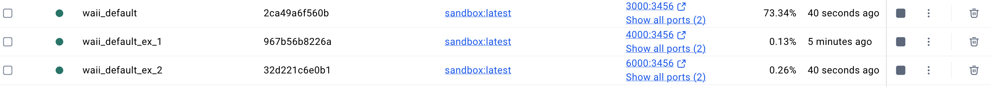
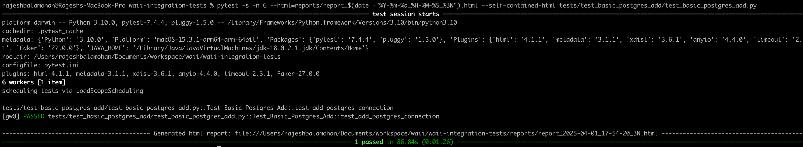

# Context:
  - This repository contains integration tests for the WAII system. 
  - Tests are designed to run against dockerized environments. Each test class can specify its desired Docker configuration via custom markers. 
  - Tests are executed in parallel using pytest, while ensuring that tests using the same docker configuration run on the same worker.

# High level details:
  * Docker Configurations:
    - Different docker configurations are available (and can be added) in `tests/docker_launcher/docker_configs.py`. Each command has the following:
      - Fully formatted Docker run command
      - Ready message to confirm container startup. Don't change this, as this is hardcoded in the docker launcher.
      - Startup timeout value. 
      - **Ensure** to provide different port numbers for different configurations. Refer to `api_port` and `port` in the docker config.
      - Use `SCRIPT_DIR` location in `docker_configs.py`. So basically, you can place in the same directory and refer as `f"{SCRIPT_DIR}/extra_file.xml"` in the docker configs.
  * Fixtures:
    - docker_environment (class‑scoped):
      - Reads the custom @pytest.mark.docker_config marker on a test class (defaults to waii_default), loads the corresponding configuration, cleans up any existing container with the same name, starts the container, and sets environment variables.
    - class_setup_api_client (class‑scoped):
      - Retrieves the base URL and API key from the current Docker configuration and then calls your custom setup and cleanup methods (custom_setup/custom_cleanup) defined on your test class.
  * Parallel Execution:
    - With `pytest -n N` and the `--dist=loadscope` option (set in `pytest.ini`), tests within the same class or module are guaranteed to run on the same worker.
        - This minimizes container conflicts and ensures that a single Docker container is shared for all tests in one class.
  

# Setup:
  - Ensure to have `OPENAI_API_KEY` in your environment variables.
  - `pip install -r requirements.txt`
  - Review docker configuration in `tests/docker_launcher/docker_configs.py`
    - Notice that MOVIE_DB will not be loaded in this docker. We plan to have local TWEAKIT itself for this. (to reduce time and cost)

# Running Tests:
  - To run specific test (from root folder):  [PREFER THIS FOR TIME BEING. REFER FAQ]
    - To run dummy demo to spin up multiple dockers, `pytest -s -n 6 --html=reports/report_$(date +"%Y-%m-%d_%H-%M-%S_%3N").html --self-contained-html tests/test_dummy/test_dummy.py`
    - To run basic sample test, `pytest -s -n 6 --html=reports/report_$(date +"%Y-%m-%d_%H-%M-%S_%3N").html --self-contained-html tests/test_basic_postgres_add/test_basic_postgres_add.py`
  - To run all tests:
    - `pytest -s -n 6 --html=reports/report_$(date +"%Y-%m-%d_%H-%M-%S_%3N").html --self-contained-html`
  - To run against existing docker:
    - There are cases, when existing docker is running and we don't want to spin up containers. We just need to run the test against default 'http://localhost:9859/api/'. 
    - If so, comment out `@pytest.mark.docker_config(..)` for the class and run the test cases. E.g
      - `pytest -s -n 6 --html=reports/report_$(date +"%Y-%m-%d_%H-%M-%S_%3N").html --self-contained-html tests/test_knowledge_import/test_knowledge_import.py`

   

# Best Practice:
 - It takes 30-60 seconds to launch a docker. Notice that this does not have MOVIE DB as well. So try to minimize additional number of dockers.
   - Instead, try to pack as many tests as possible in same docker, unless and until there is a need to change the docker config.
 - Prefer to launch 2-3 dockers via `pytest -n 3 ...` to avoid timeout errors
 - If you need more parallelism for the same docker configuration, feel free to create another config with different name.
   - This will be assigned to different worker and will run in parallel.

# Debugging:
  - When tests are started, all containers and its pg/log folders will be deleted.
    - If you wish to see the logs, you can check the logs after the tests are executed.
  - logs about tests are written in `logs` folder.
    - This will have details on the dockers being started, which tests are executed etc.
  - reports are written to `reports` folder.

# FAQ / Yet to fix:
  -  Having same docker config for multiple test classes and it seems slow. Why?
    - Tests belonging to same docker configs are grouped together and scheduled in the same worker. Within this, it will be executed in sequential mode.
      - It is possible to create additional docker configs with different name, port numbers and use them in the test classes. This will ensure that the tests are run in parallel.
  - Sometimes docker is not starting. What should be done?
    - Try clearing off `$HOME/waii-sandbox-test-integ/*` contents. 
  - Sometimes test cases are failing in connection
    - Double check if `"api_port":` is specified correctly in docker_configs.py. Note that it has to be unique across dockers.
  - Timeout in running all benchmarks together
    - Default
  - Where should I place the additional docker files that will be used in docker configs?
    - Use `SCRIPT_DIR` location in `docker_configs.py`. So basically, you can place in the same directory and refer as `f"{SCRIPT_DIR}/extra_file.xml"` in the docker configs.
    
